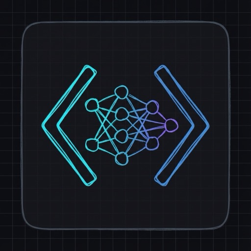
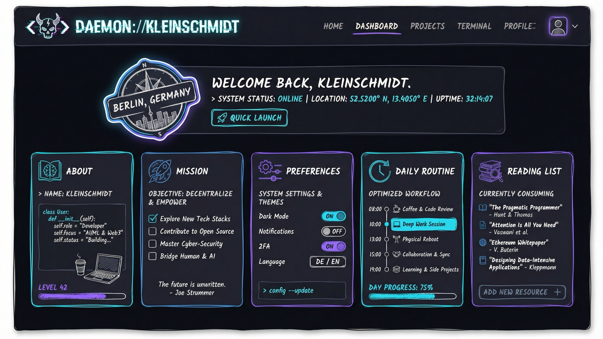

<p align="center">
  
</p>

<h1 align="center">Daemon</h1>

<p align="center">
  <strong>A personal API for human connection</strong>
</p>

<p align="center">
  <a href="https://daemon.timkleinschmidt.com">Live Site</a> ·
  <a href="https://github.com/danielmiessler/Daemon">Original Project</a>
</p>

<p align="center">
  
</p>

---

## The Vision: Connecting Humans, Not Just Devices

The future isn't about connecting refrigerators to the internet. It's about **connecting people to each other** through AI-powered personal assistants that know us, represent us, and handle the complexity of modern life on our behalf.

Your daemon is your digital representative—it knows your preferences, your availability, your interests—and it can interact with other people's daemons to find common ground, schedule meetings, or discover shared interests.

This project is forked from [Daniel Miessler's Daemon](https://github.com/danielmiessler/Daemon), who pioneered the concept of personal APIs for human connection. Read more about the original vision:
- [The Real Internet of Things](https://danielmiessler.com/blog/real-internet-of-things) - Digital Assistants and the future of human-AI interaction
- [Personal AIs Will Mediate Everything](https://danielmiessler.com/blog/personal-ais-will-mediate-everything) - Why personal AI assistants will become our primary interface to the world

## What is a Daemon?

A daemon is a **public API that represents you**. It exposes the information you want to share with the world in a structured, queryable format that both humans and AI systems can access.

Think of it as your digital business card, but infinitely more powerful:
- **For humans**: A beautiful website showing who you are and what you're about
- **For AI systems**: An MCP (Model Context Protocol) server that can be queried programmatically
- **For connection**: A standardized way for your AI assistant to talk to someone else's AI assistant

## About This Fork

This repository is a personal fork of [Daniel Miessler's Daemon](https://github.com/danielmiessler/Daemon), customized for Tim Kleinschmidt. It's running at [daemon.timkleinschmidt.com](https://daemon.timkleinschmidt.com). Fork it yourself to create your own daemon.

## Features

- **Static Website**: Beautiful, fast Astro-based site showcasing your daemon info
- **MCP Server**: Query your daemon programmatically via the Model Context Protocol
- **Cloudflare Pages**: Deploy globally with zero configuration
- **Forkable**: Designed to be forked and customized for your own daemon

## Quick Start

```bash
# Clone the repo
git clone https://github.com/Azd325/Daemon.git
cd Daemon

# Install dependencies
bun install

# Run locally
bun run dev

# Build for production
bun run build

# Deploy to Cloudflare Pages
bunx wrangler pages deploy dist --project-name=your-daemon-name
```

## Customization

1. **Edit your daemon info**: Update `public/daemon.md` with your own information
2. **Customize the design**: Modify the Astro components in `src/`
3. **Update branding**: Replace images in `public/` with your own
4. **Deploy**: Push to your own Cloudflare Pages project

## Architecture

### The Data File

The `public/daemon.md` file is the **source of truth** for your daemon's information. It uses a simple section-based format:

```markdown
[ABOUT]
Your bio goes here...

[MISSION]
Your mission statement...

[FAVORITE_BOOKS]
- Book 1
- Book 2
```

Available sections: `ABOUT`, `CURRENT_LOCATION`, `MISSION`, `TELOS`, `FAVORITE_BOOKS`, `FAVORITE_MOVIES`, `FAVORITE_PODCASTS`, `DAILY_ROUTINE`, `PREFERENCES`, `PREDICTIONS`

### How the Live Site Works

The live site at [daemon.timkleinschmidt.com](https://daemon.timkleinschmidt.com) uses a two-component architecture:

1. **This repo** → The Astro website (what you're looking at)
2. **MCP Server** → A separate Cloudflare Worker that serves the daemon data via API

The website's dashboard fetches data from the MCP server at `mcp.daemon.timkleinschmidt.com`. This enables real-time API access for AI systems while the static site provides the human-readable interface.

### For Forkers: MCP Server Setup (Advanced)

If you want the full experience with a queryable MCP endpoint:

1. The MCP server is a separate Cloudflare Worker that:
   - Parses your `daemon.md` file
   - Stores the data in Cloudflare KV
   - Serves it via JSON-RPC (MCP protocol)

2. You'll need to:
   - Create a Cloudflare Worker for your MCP endpoint
   - Set up a KV namespace for data storage
   - Update the dashboard component to point to your MCP URL

3. The MCP server code and setup instructions will be documented separately.

**Note**: The static site works without the MCP component—you just won't have the live API functionality until you set up your own MCP server.

## Why Should You Have a Daemon?

1. **Own your digital identity**: Your daemon is yours, hosted where you choose
2. **Enable AI-to-AI communication**: As AI assistants become more prevalent, they'll need standardized ways to learn about people
3. **Future-proof your online presence**: Static sites with structured data are the most resilient format
4. **Join the network**: Every daemon makes the network more valuable for everyone

## The Bigger Picture

We're building toward a future where:
- Your AI assistant can find the right person to help with a problem by querying their daemon
- Scheduling a meeting means your daemon talking to their daemon
- Professional networking happens through AI matching compatible daemons
- Serendipitous human connections are facilitated by daemon-to-daemon discovery

This isn't about replacing human interaction—it's about **enabling more of it** by removing the friction and overhead that currently prevents connection.

## Tech Stack

- [Astro](https://astro.build) - Static site generation
- [Bun](https://bun.sh) - JavaScript runtime
- [Cloudflare Pages](https://pages.cloudflare.com) - Hosting and deployment
- [MCP](https://modelcontextprotocol.io) - Model Context Protocol for AI integration

## Credits

This project is forked from [Daniel Miessler's Daemon](https://github.com/danielmiessler/Daemon). Check out the original repo and Daniel's other projects:
- [Fabric](https://github.com/danielmiessler/fabric) - AI prompts for solving everyday problems
- [Human 3.0](https://human3.danielmiessler.com) - The framework for thriving in an AI world

## License

MIT - Fork it, customize it, make it yours.

